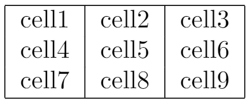

## example

```latex
\begin{center}
\begin{tabular}{ |c|c|c| } 
 \hline
 cell1 & cell2 & cell3 \\ 
 cell4 & cell5 & cell6 \\ 
 cell7 & cell8 & cell9 \\ 
 \hline
\end{tabular}
\end{center}
```


**{ |c|c|c| }**

声明了3列，使用 `|` 分割开

- `c` 表明列居中对齐 
- `l` 表明列居左对齐
- `r` 表明列居右对齐

**\hline**

在行的顶和底添加水平线

**cell1 & cell2 & cell3 \\\\**

- `&` 单元格分隔符 

- `\\` 行分隔符

